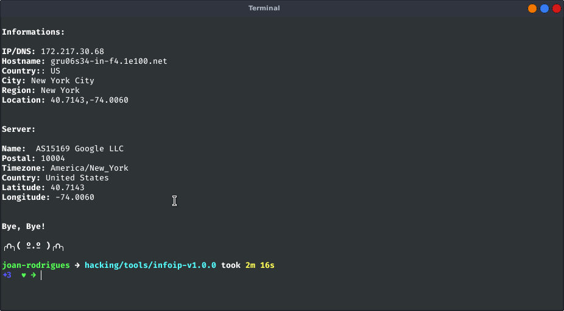
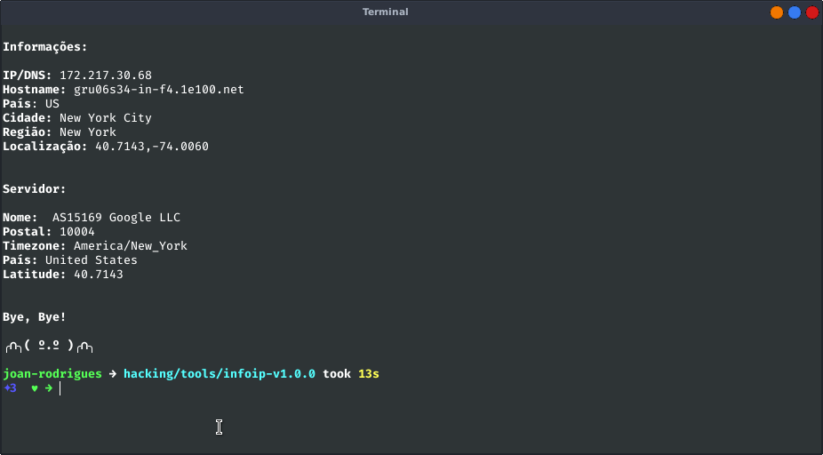

# InfoIP
#### By: Joan Rodrigues

Python software to get information about a particular IP.

## Description

InfoIP is GNU / Linux software developed entirely in Python. With it you can get a lot of information about any IP contained on the Internet.

## Installation

To do the installation just run this command in the terminal:

~~~
pip install -r requirements.txt
~~~

And then just run the program with this:

~~~
./infoip.py
~~~

## Screenshots

# EN-US:

# PT-BR:

## License

[GPL]
